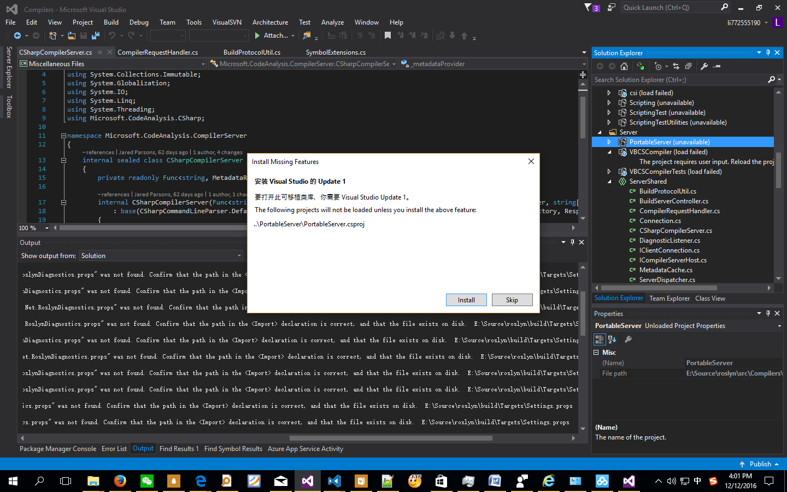

## 错误

> 图片文件名不能包含空格



这种错误谁信，浪费我时间,Update 3都安装好了。


```
roslyn\src\Compilers\Core\Portable\CodeAnalysis.csproj
```

``` xml

<TargetFrameworkIdentifier>.NETPortable</TargetFrameworkIdentifier>  E:\Source\roslyn\src\Compilers\Core\Portable\CodeAnalysis.csproj
<TargetFrameworkVersion>v5.0</TargetFrameworkVersion>

```

原来官方的wiki里有Walkthroughs.md,最新的可能需要vs 2017编译。


**Getting Started on Visual Studio 2015.md** 这才是真正的安装环境，遇到问题了先从官网看呗！
浪费我好多时间。
