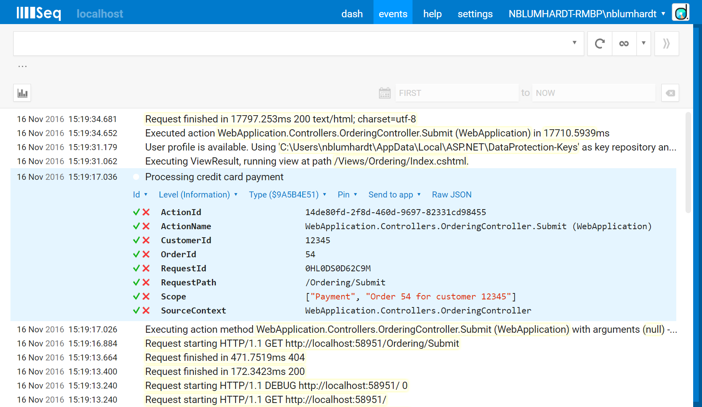

[The semantics of ILogger.BeginScope()](https://nblumhardt.com/2016/11/ilogger-beginscope/)


Microsoft.Extensions.Logging’s `ILogger` adds context to log events with `BeginScope()`:

```cs
using (logger.BeginScope("Checking mail"))
{
   // Scope is "Checking mail"
   logger.LogInformation("Opening SMTP connection");

   using (logger.BeginScope("Downloading messages"))
   {
       // Scope is "Checking mail" -> "Downloading messages"
       logger.LogError("Connection interrupted");
   }
}
```

Each call to BeginScope() creates another level of nesting, so that events produced within the scope can be tagged with information about where they came from. Nice and intuitive.

Here’s the challenge for implementers:

```cs
public interface ILogger
{
    /// <summary>
    /// Begins a logical operation scope.
    /// </summary>
    /// <param name="state">The identifier for the scope.</param>
    /// <returns>An IDisposable that ends the logical operation scope on dispose.</returns>
    IDisposable BeginScope<TState>(TState state);

    // ...
```

BeginScope() is generic over TState. This makes sense at one level - a provider that doesn’t implement scoping can ignore BeginScope(42) - that is, TState being a struct - without any boxing overhead.

On another level, this does create some ambiguity. TState can be absolutely anything, so while BeginScope("Checking mail") has a pretty clear interpretation, what about BeginScope(Thread.CurrentThread)? BeginScope(new Dictionary<string, object>{ ["OrderId"] = 54 })? The possible state arguments are completely open-ended, and just blindly adding them to the scope hierarchy using ToString() won’t always record useful information.

I recently worked through this question and updated the Serilog provider (at the time of writing, you’ll need to grab the -Pre version) and new Seq provider based on my conclusions. In the hope that it might help others implement the API cleanly, here are the rules I ended up with.
1. If the state argument is IEnumerable<KeyValuePair<string, object>>, the values are attached to the event directly

This may not be entirely intuitive, if you think of Scope as a trail of breadcrumbs. If you’ve dealt with correlating log events in a distributed application, you’ll recognize that often you’re interested in log events related to a specific transaction, customer, request, thread, machine or endpoint.

In the absence of any other API for the purpose, BeginScope() is how these correlation ids need to be attached in Microsoft.Extensions.Logging:

using (logger.BeginScope(new Dictionary<string, object>({
    ["CustomerId"] = 12345,
    ["OrderId"] = 54
})))
{
    logger.LogInformation("Processing credit card payment");
}

In this case, events created in the scope will have two additional properties attached: CustomerId and OrderId.

Types that implement IEnumerable<KeyValuePair<string, object>> rarely have any other useful representation; ToString() on a dictionary generally just provides the type name. These values therefore don’t result in a breadcrumb-like Scope property.
2. If state is not IEnumerable<KeyValuePair<string, object>>, it’s added to the Scope property

In other cases, where the state doesn’t carry a list of properties, it adds to an implied Scope property on the event:

using (logger.BeginScope(42))
{
   using (logger.BeginScope("Example"))
   {
       using (logger.BeginScope(downloader.Uri))
       {
           logger.LogInformation("Hello, world!");
       }
   }    
}

The structured representation of the event here gets a Scope property containing an array of values from least-to-most-specific:

{"Scope": [42, "Example", "https://serilog.net"], "@m": "Hello, world!", ...}

3. If the state is created with a message template, the rendered value is added to Scope

This final rule deals with:

using (logger.BeginScope("Order {OrderId} for customer {CustomerId}", 54, 12345))
{
    logger.LogInformation("Processing credit card payment");
}

The BeginScope() extension method used here creates an instance of the internal FormattedLogValues class, which is IEnumerable<KeyValuePair<string, object>>, so the properties OrderId and CustomerId will be added to the event via rule (1). (The template is detected by the presence of an {OriginalFormat} property attached to the event.)

The message template can also be rendered into the text "Order 54 for customer 12345", so this rendered value is added to the Scope property as well.

Here’s the example, displayed in Seq:



## How should BeginScope() be used?

Just because you can pass practically anything to BeginScope() doesn’t mean that you necessarily should. It’s important for a provider to capture the most useful information it can, hence this article, but as a diagnostic aid I’m strongly biased towards the judicious use of Dictionary<string, object> scope values, rather than hierarchical scope names.

Structured key/value properties are self-documenting and simpler to query. A log filter like OrderId = 54 is easy to formulate. The Scope array doesn’t attach any meaning to each level in the hierarchy: Scope[?] = 'Downloading messages' might retrieve a meaningful set of events, but Scope[0] = 42 is just nonsense.

Of course, the flexibility is there, so you should use the API in the manner that makes the most sense to you :-).

Implementing or using BeginScope()? In a similar or different manner? It’d be interesting to hear your opinions!
