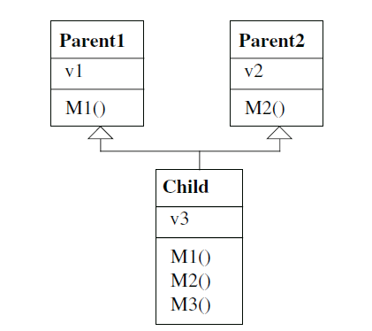
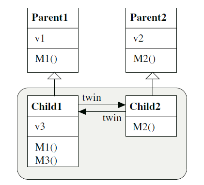

[Category:Software design patterns](https://en.wikipedia.org/wiki/Category:Software_design_patterns)

> 子类可以使用 twin变量（一个有标志性的变量）互相引用。

In software engineering, the Twin pattern is a software design pattern that allows developers to model multiple inheritance in programming languages that do not support multiple inheritance. This pattern avoids many of the problems with multiple inheritance.[1]

## Definition

Instead of having a single class which is derived from two super-classes, have two separate sub-classes each derived from one of the two super-classes. These two sub-classes are closely coupled, so, both can be viewed as a Twin object having two ends.[1]

## Applicability

The twin pattern can be used:

* to model multiple inheritance in a language in which multiple inheritance is not supported
* to avoid some problems of multiple inheritance.[1]

## Structure

## Collaborations

Each child class is responsible for the protocol inherited from its parent. It handles the messages from this protocol and forwards other messages to its partner class. [1]

Clients of the twin pattern reference one of the twin objects directly and the other via its twin field.[1]

Clients that rely on the protocols of parent classes communicate with objects of the respective child class.[1]