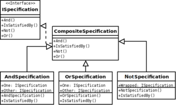

[Specification pattern](https://en.wikipedia.org/wiki/Specification_pattern)

> 用布尔值Function组合可能更好。

In computer programming, the specification pattern is a particular software design pattern, whereby business rules can be recombined by chaining the business rules together using boolean logic. The pattern is frequently used in the context of domain-driven design.

A specification pattern outlines a business rule that is combinable with other business rules. In this pattern, a unit of business logic inherits its functionality from the abstract aggregate Composite Specification class. The Composite Specification class has one function called IsSatisfiedBy that returns a boolean value. After instantiation, the specification is "chained" with other specifications, making new specifications easily maintainable, yet highly customizable business logic. Furthermore, upon instantiation the business logic may, through method invocation or inversion of control, have its state altered in order to become a delegate of other classes such as a persistence repository.

## Criticisms

The Specification Pattern could be considered a software Anti-Pattern:

* Cargo Cult Programming - There lacks a well-defined purpose for this pattern, and there's no guide when to implement it or not. Also, see Law of the instrument.
* Inner-platform effect - And() function which directly replicate && in C#. Also, Not() and potentially more. Also, see Reinventing the square wheel.
* Spaghetti/Lasagna Code - Separate classes for each part of the specification fragments what could be a cohesive object. In the example above, OverDue is an extra layer between the Logic for SendToCollection and the OverDueSpecification implementation.
