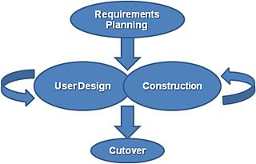

[Rapid application development ](https://en.wikipedia.org/wiki/Software_development_process#Rapid_application_development)

The basic principles of rapid application development are:[1]

* Key objective is for fast development and delivery of a high quality system at a relatively low investment cost.

* Attempts to reduce inherent project risk by breaking a project into smaller segments and providing more ease-of-change during the development process.

* Aims to produce high quality systems quickly, primarily via iterative Prototyping (at any stage of development), active user involvement, and computerized development tools. These tools may include Graphical User Interface (GUI) builders, Computer Aided Software Engineering (CASE) tools, Database Management Systems (DBMS), fourth-generation programming languages, code generators, and object-oriented techniques.

* Key emphasis is on fulfilling the business need, while technological or engineering excellence is of lesser importance.

* Project control involves prioritizing development and defining delivery deadlines or “timeboxes”. If the project starts to slip, emphasis is on reducing requirements to fit the timebox, not in increasing the deadline.

* Generally includes joint application design (JAD), where users are intensely involved in system design, via consensus building in either structured workshops, or electronically facilitated interaction.

* Active user involvement is imperative.

* Iteratively produces production software, as opposed to a throwaway prototype.

* Produces documentation necessary to facilitate future development and maintenance.

* Standard systems analysis and design methods can be fitted into this framework.

[Rapid application development](https://en.wikipedia.org/wiki/Rapid_application_development)

**RAD**

