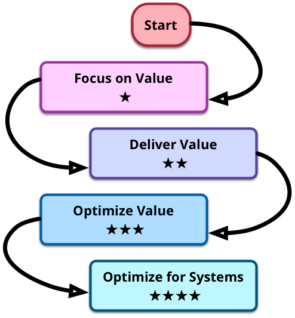

[Agile Software Development](http://martinfowler.com/agile.html)

## The Essence of Agile Software

### Agile Development is adaptive rather than predictive  is people-oriented rather than process-oriented

Plan-driven engineering expects us to come up with a predictive plan that precedes development. The plan lays out the people, resources and timelines for the overall project. Software design is also done up-front, with implementation expected to conform with this design. Success is measured according to how well development follows this plan.

Agile plans are a baseline that we use to help us control change. Agile teams plan just as carefully as traditional teams, but the plans are constantly changing to reflect the things we learn during a project. Success is based on value delivered by the software.

Plan-driven engineering seeks a process which provides enough structure to reduce individual variations to insignificance. Such an industrial process is more predictable, copes better when people transfer, and is easier to define skills and career paths.

Agile engineering sees software development as a primarily human activity, where the people involved and how they bond as a team are the primary driver behind success. Processes (and tools) can enhance a team's effectiveness, but are always second-order influences.

## Agile Fluency Model

Adopting agile software development is neither a quick nor easy path. Diana Larsen and James Shore (experienced agile coaches) 
have come up with a way to think about how teams progress through stages of fluency in agile thinking. The path begins by focusing on value and then progresses to delivering and optimizing that value. Diana and James outline the benefits of each stage and the what investments you need to make to get there.

