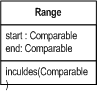
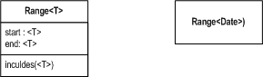

[Range](http://martinfowler.com/eaaDev/Range.html)

# Range

Represent a range of values

This is part of the [Further Enterprise Application Architecture development](/eaaDev) writing that I was doing in the mid 2000’s. Sadly too many other things have claimed my attention since, so I haven’t had time to work on them further, nor do I see much time in the foreseeable future. As such this material is very much in draft form and I won’t be doing any corrections or updates until I’m able to find time to work on it again.

It's quite common to see comparisons where a value is checked
  against a range of values. Ranges are usually handled by a pair of
  values and you check against them both. Range instead uses a
  single object to represent the range as a whole, and then provides
  the relevant operations to test to see if values fall in the range
  and to compare ranges.

## How it Works

 The basic class is very simple. You have a class with two fields
  that represent the start and end of the range. You also provide an
  includes method that tests to see if the supplied value falls within
  the range.

You can use Range with any type that supports comparison
  operations, that is the moral equivalent of &lt;, &gt;, =, &lt;=,
  and &gt;=. Depending on the language and the type you may or may not
  get these exact operators, but you need the equivalent relationships
  on the types, that is you need to have some default sort criteria
  that allows you to rank the values.

Figure 1: Showing ranges in UML with
  parameterized type notation

Range is an obvious choice
  for a parameterized class
  [ Figure 1](#range_paramRange.gif), if your language supports this. In UML terms you can
  show ranges of different kinds by using classes with types
  Range&lt;number&gt; and Range&lt;date&gt;. This is really just
  modeling shorthand for Range of Numbers and Range of
  Dates. Therefore many people, including myself, prefer to avoid the
  strange names and just use terms like Number Range and Data Range.

A more sophisticated Range can be set with a sort criteria. In
  general this can be any function that's capable of ranking instances
  of the type that's being used in the range. The sort criteria is
  essentially a function, or an object that wraps a function.

You'll probably have some open ended ranges (eg greater than
  six). You can handle this a couple of ways. One is to treat a null
  value as meaning unlimited. Your range checking code will get a bit
  more complicated, but pretty much you can hide this from your
  users. Another alternative is to make a [Special Case](http://martinfowler.com/eaaCatalog/specialCase.html) for the extremes (e.g. positive
  infinity). Whichever choice you make you can hide from users of the
  class by having creation methods of the form
  `Range.greaterThan(6).`

If the type you are ranging over is continuous (eg a real number)
  as opposed to discrete (like an integer or date) you'll need other
  information to tell if the upper or lower are within the range. With
  integers you can choose a range greater than six by setting the
  lower to seven. However with a real number you don't want to be
  using a lower of 6.0000000000001. Use a couple of boolean markers
  instead.

As well as operations that test if a value is in a range, you can
  also include operations that compare ranges: these can tell if one
  range overlaps another, if one range touches another, or one range
  includes another. These can be very helpful when you need to do
  things like check that some subset of ranges includes all values in
  another range.

Range classes obviously suit themselves to parameterized classes,
  if your language uses them. If not you are faced with either
  building them based on an abstract class or creating specialized
  subtypes for specific cases. If you are likely to be getting the
  upper and lower values for other purposes, then the pain of
  downcasting will be enough that you'd be better off making a
  concrete range class.

When thinking about ranges, I find the most common approach is to
  have a start and an end. However it's equally useful to have a start
  and a length, or even an end and length. You can also have all
  three: start, end, and length with the obvious constraint between
  the values.

## When to Use It

Range is a pattern I use all the time. Coding an appropriate
  range class is easy, and once you've done that it's easier to use a
  range than to use pairs of values. When modeling it's more explicit
  to use ranges than to use pairs - and just as intuitive.

## Example: Date Range (Java)

For an example I'll use a date range. It's a common range to need
  to use, and allows me to neatly dodge the extra complexities of a
  continuous range. Rather than using Java's standard date, I'm using
  my own date class that only has date precision (see the discussion
  in [Time Point](TimePoint.html).

The basic constructors and accessors are quite simple.

class DateRange...

<pre>  public DateRange (Date start, Date end) {
    this (new MfDate(start), new MfDate(end));
  }
  public DateRange (MfDate start, MfDate end) {
    this.start = start;
    this.end = end;
  }
</pre>

class DateRange...

<pre>  public MfDate end(){
    return end;
  }
  public MfDate start() {
    return start;
  }
  public String toString() {
    if (isEmpty()) return "Empty Date Range";
    return start.toString() + " - " + end.toString();
  }
  public boolean isEmpty() {
    return start.after(end);
  }

</pre>

The key method to provide in any use of Range is the includes method.

class DateRange...

<pre>  public boolean includes (MfDate arg) {
    return !arg.before(start) &amp;&amp; !arg.after(end);
  }

</pre>

 I like to provide extra constructors for open-ended ranges and the empty range.

class DateRange...

<pre>  public static DateRange upTo(MfDate end) {
    return new DateRange(MfDate.PAST, end);
  }
  public static DateRange startingOn(MfDate start) {
    return new DateRange(start, MfDate.FUTURE);
  }
  public static DateRange EMPTY = new DateRange(new MfDate(2000,4,1), new MfDate(2000,1,1));

</pre>

It's useful to provide operations which allow you to compare ranges.

class DateRange...

<pre>  public boolean equals (Object arg) {
    if (! (arg instanceof DateRange)) return false;
    DateRange other = (DateRange) arg;
    return start.equals(other.start) &amp;&amp; end.equals(other.end);
  }
  public int hashCode() {
    return start.hashCode();
  }
  public boolean overlaps(DateRange arg) {
     return arg.includes(start) || arg.includes(end) || this.includes(arg);
   }
  public boolean includes(DateRange arg) {
    return this.includes(arg.start) &amp;&amp; this.includes(arg.end);
  }

</pre>

For most applications this is all you need. But certain situations suggest other useful behaviors. One it to find out what gap exists between two ranges.

class DateRange...

<pre>  public DateRange gap(DateRange arg){
    if (this.overlaps(arg)) return DateRange.EMPTY;
    DateRange lower, higher;
    if (this.compareTo(arg) &lt; 0) {
      lower = this;
      higher = arg;
    }
    else {
      lower = arg;
      higher = this;
    }
    return new DateRange(lower.end.addDays(1), higher.start.addDays(-1));
  }
  public int compareTo(Object arg) {
    DateRange other = (DateRange) arg;
    if (!start.equals(other.start)) return start.compareTo(other.start);
    return end.compareTo(other.end);
  }
</pre>

Another is to detect whether two date ranges abut each other.

class DateRange...

<pre>  public boolean abuts(DateRange arg) {
    return !this.overlaps(arg) &amp;&amp; this.gap(arg).isEmpty();
  }

</pre>

And to see if a group of ranges completly partitions another range.

class DateRange...

<pre>  public boolean partitionedBy(DateRange[] args) {
    if (!isContiguous(args)) return false;
    return this.equals(DateRange.combination(args));
  }
  public static DateRange combination(DateRange[] args) {
    Arrays.sort(args);
    if (!isContiguous(args)) throw new IllegalArgumentException("Unable to combine date ranges");
    return new DateRange(args[0].start, args[args.length -1].end);
  }
  public static boolean isContiguous(DateRange[] args) {
    Arrays.sort(args);
    for (int i=0; i&lt;args.length - 1; i++) {
        if (!args[i].abuts(args[i+1])) return false;
    }
    return true;
  }

</pre>

