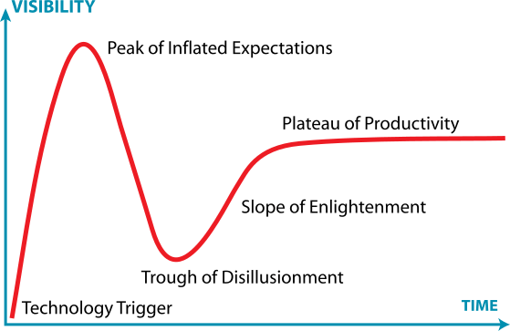

[技术的热门度曲线](http://www.ruanyifeng.com/blog/2017/03/gartner-hype-cycle.html)

全球最大的 IT 咨询公司高德纳（Gartner），有一个"技术热门度曲线"模型（Gartner Hype Cycle）。

该模型认为，一门技术的发展要经历五个阶段。

* （1）启动期（Innovation Trigger）

    该技术刚刚诞生，还只是一个概念，不具有可用性，无法评估商业潜力。媒体有所报道，引起了外界的兴趣。

* （2）泡沫期（Peak of Inflated Expectations）

    该技术逐步成型，出现了个别成功的案例，一些激进的公司开始跟进。媒体开始大肆报导，伴有各种非理性的渲染，产品的知名度达到高峰。

* （3）低谷期（Trough of Disillusionment）

    该技术的局限和缺点逐步暴露，对它的兴趣开始减弱。基于它的产品，大部分被市场淘汰或者失败，只有那些找到早期用户的公司艰难地活了下来。媒体对它的报道逐步冷却，前景不明。

* （4）爬升期（Slope of Enlightenment）

    该技术的优缺点越来越明显，细节逐渐清晰，越来越多的人开始理解它。基于它的第二代和第三代产品出现，更多的企业开始尝试，可复制的成功使用模式出现。媒体重新认识它，业界这一次给予了高度的理性的关注。

* （5）高原期（Plateau of Productivity）

    经过不断发展，该技术慢慢成为了主流。技术标准得到了清晰定义，使用起来越发方便好用，市场占有率越来越高，进入稳定应用阶段。配合它的工具和最佳实践，经过数代的演进，也变得非常成熟了。业界对它有了公认的一致的评价。
